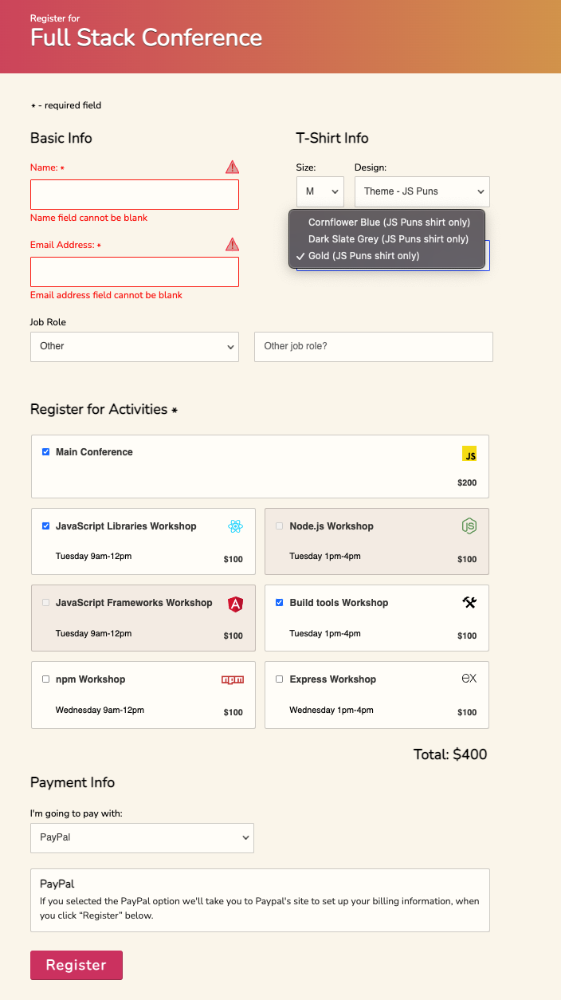

# Interactive-Form
Enhance an interactive registration form for a fictional Full Stack conference.

## Project Requirements included:
- On page load, the cursor appears in the "Name" field, ready for a user to type.
- In the Job Role section, display/hide the "Other job role" text field when a user selects/deselects "Other" from the Job Role menu.
- In the T-Shirt section, ensure all of the following are true:
  * The "Color" field is disabled when the page loads.
  * The "Color" field is enabled when a "Theme" is selected.
  * The "Color" field updates correctly when a T-Shirt theme is selected or changed.
  * The "Color" drop down menu updates correctly when a T-Shirt theme is selected or changed.
- In Register of Activities section, correctly update the total cost of selected activities in the form when users select or deselect activities.

### Form Validation
- Form submission uses the submit event on the form element.
- Form cannot be submitted (the page does not refresh when the submit button is clicked) until the following requirements have been met:
  * "Name" field isn’t blank.
  * "Email" field contains a correctly formatted email address.
  * At least one activity has been selected.
  * If "Credit Card" is the selected payment option, the three credit card fields accept only numbers: a 13 to 16-digit credit card number, a 5-digit zip code, and 3-digit CVV value.
- When all the required fields are filled out correctly, the form submits (the page refreshes on its own when the submit button is clicked).

### Accessibility
- Make the focus states of the activities more obvious to all users. Pressing the tab key on your keyboard moves the focus state from one input to the next, but the focus indicators in the "Register for Activities" section aren’t very obvious.
- Make the form validation errors obvious to all users. With the custom form validation checks you’ve already written, invalid form fields will prevent the form from submitting, but all users should be presented with clear notifications of which fields are invalid.

## Extra Credit
- Prevent users from registering for conflicting activities.
  * Ideally, we want to prevent users from selecting activities that occur at the same time.
   
- Real-time error message.
  * Providing form validation error indications at the moment they occur better serves your user.
   
- Conditional error message.
  * Providing additional information for certain types of errors can be very helpful to your user. For example, if the email address field is empty, it would be   enough to inform the user that they should add an email address. But if they’ve already added an email address, but formatted it incorrectly, that message wouldn’t be helpful.
   
   

